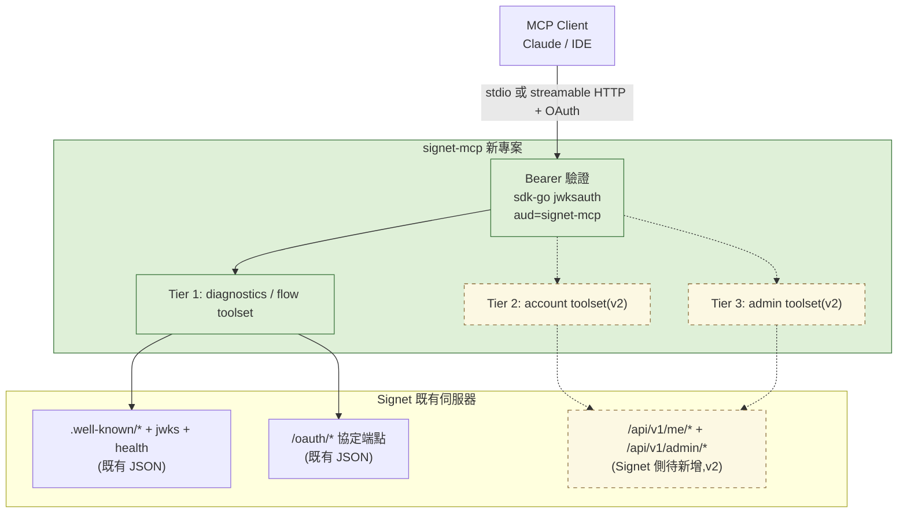

# Plan: signet-mcp — Signet 的 MCP Server(v1 Tool 清單)

## Goal

為 [Signet](https://github.com/go-signet/signet)(OAuth 2.0 Authorization Server)提供一個官方 MCP server,讓 AI 助理(Claude Code、IDE、聊天客戶端)能直接操作 Signet。服務三種角色:

1. **開發者整合除錯** — 檢查 discovery metadata、驗證 JWT、測試 OAuth 四種 flow、診斷 token 問題
2. **使用者自助服務** — 管理自己的登入裝置、connected apps、授權紀錄、personal API keys
3. **管理者運維** — 管理使用者、OAuth clients、token 生命週期、查詢 audit log

「Done」的定義:signet-mcp 以 Go 實作,透過 stdio 與 streamable HTTP 兩種 transport 提供下列 Tool 清單;HTTP 模式下自身即為受 Signet 保護的 OAuth resource server(dogfooding:RFC 8707 audience 綁定 + RFC 9728 PRM)。

**v1 範圍已定案:僅 Tier 1(15 個 tools),純 tools(不含 MCP Resources/Prompts)。** Tier 2(使用者自助)與 Tier 3(管理者運維)依賴 Signet 側新增 API,列為 v2 backlog,本計畫不處理。

## 架構 / 分層

**關鍵發現(來自 signet source code 探索)**:

- Signet 的 **OAuth 協定端點**(`/oauth/*`、`/.well-known/*`、`/health`)已是 JSON API → Tier 1 工具**零 Signet 改動**即可實作。
- Signet 的 **account/admin 管理端點**目前只回 HTML、只吃 session cookie 驗證(`internal/bootstrap/router.go:400-523`)→ Tier 2/3 工具需要 Signet 側新增 Bearer-token 驗證的 JSON API(`/api/v1/me/*`、`/api/v1/admin/*`)。**這是 signet repo 的 core 變更,需另立計畫、人工主導**(見 Risks)。
- 兄弟專案 `sdk-go` 已提供 oauth client、discovery、jwksauth(離線 JWT 驗證)、bearerauth(JWT + `sgk_` key)— signet-mcp 直接重用,不重造輪子。

工具依 **toolset** 分組(仿 github-mcp-server 的 `--toolsets` 模式),可由設定啟用/停用。v1 出貨 `diagnostics` 與 `flow`(皆預設開);`account`、`admin` 為 v2 backlog 預留名稱,待 Signet 側 API 到位後再實作。

## Tool 清單(v1 提案)

命名規則:`signet_<域>_<動作>`,全 snake_case。Annotations 依 MCP spec:`R` = readOnlyHint、`W` = 寫入(non-destructive)、`D` = destructiveHint、`I` = idempotentHint。

### Tier 1a — 診斷工具(toolset: `diagnostics`,零 Signet 改動)

| # | Tool | 說明 | 對應端點 / 實作 | Ann. |
|---|------|------|----------------|------|
| 1 | `signet_get_metadata` | 抓取並整理 AS metadata(RFC 8414)與 OIDC discovery,比對兩者差異 | `/.well-known/oauth-authorization-server`、`/.well-known/openid-configuration` | R |
| 2 | `signet_get_jwks` | 取得 JWKS 公鑰,列出 kid / alg / 金鑰類型 | `/.well-known/jwks.json` | R |
| 3 | `signet_health` | 伺服器健康狀態、依賴探測、功能開關狀態 | `/health` | R |
| 4 | `signet_decode_jwt` | **離線**解碼 JWT + JWKS 簽章驗證,逐項檢查 `iss`/`aud`/`exp`/`type` 並解釋失敗原因(如 refresh token 冒充 access token) | 本地 + sdk-go `jwksauth` | R |
| 5 | `signet_tokeninfo` | 線上驗證 access token 有效性(會拒絕 `type != "access"`) | `GET /oauth/tokeninfo` | R |
| 6 | `signet_introspect_token` | RFC 7662 introspection(需 client 憑證),回完整 metadata | `POST /oauth/introspect` | R |
| 7 | `signet_userinfo` | 以 token 取得 OIDC UserInfo claims | `GET /oauth/userinfo` | R |
| 8 | `signet_validate_cimd` | 抓取並驗證 Client ID Metadata Document(MCP 2026-07-28 onboarding) | 抓 CIMD URL + 本地驗證 | R |
| 9 | `signet_revoke_token` | RFC 7009 撤銷指定 token | `POST /oauth/revoke` | W, I |

### Tier 1b — Flow 測試工具(toolset: `flow`,零 Signet 改動)

| # | Tool | 說明 | 對應端點 / 實作 | Ann. |
|---|------|------|----------------|------|
| 10 | `signet_device_flow_start` | 發起 Device Code flow(RFC 8628),支援 `resource` 參數,回 `user_code` + `verification_uri` | `POST /oauth/device/code` | W |
| 11 | `signet_device_flow_poll` | 輪詢 device token(單次或限時輪詢),解讀 `authorization_pending`/`slow_down` 等錯誤 | `POST /oauth/token` (device_code) | W |
| 12 | `signet_build_authorize_url` | 本地產生 PKCE verifier/challenge(S256)+ 組出 `/oauth/authorize` URL(支援 `resource`) | 本地實作 | R |
| 13 | `signet_exchange_code` | 以 authorization code + PKCE 換 token,驗證 RFC 9207 `iss` | `POST /oauth/token` (authorization_code) | W |
| 14 | `signet_client_credentials_token` | 取得 M2M token,驗證 client 設定是否正確 | `POST /oauth/token` (client_credentials) | W |
| 15 | `signet_refresh_token` | 執行 refresh,可觀察 rotation 模式與 RFC 8707 §2.2 audience 收斂行為 | `POST /oauth/token` (refresh_token) | W |

### Tier 2 — 使用者自助(toolset: `account`)— **v2 backlog,本計畫不實作**(需 Signet 新增 `/api/v1/me/*`)

| # | Tool | 說明 | 對應現有功能 | Ann. |
|---|------|------|--------------|------|
| 16 | `signet_my_devices_list` | 列出自己所有瀏覽器/裝置登入(IP、UA、first/last seen) | `/account/devices` | R |
| 17 | `signet_my_device_revoke` | 遠端登出單一裝置,或一鍵登出其他所有裝置(`all_others=true`) | `/account/devices/:id/revoke`、`/revoke-others` | D, I |
| 18 | `signet_my_connected_apps_list` | 列出發給 apps/CLI 的 OAuth tokens(client、scopes、時效) | `/account/connected-apps` | R |
| 19 | `signet_my_connected_app_update` | 對單一 token 執行 `revoke` / `disable` / `enable`,或 `revoke_all` | `/account/connected-apps/:id/*` | D, I |
| 20 | `signet_my_authorizations_list` | 列出 per-app 授權(granted scopes、時間) | `/account/authorizations` | R |
| 21 | `signet_my_authorization_revoke` | 撤銷單一 app 授權(連帶撤銷其 tokens) | `/account/authorizations/:uuid/revoke` | D, I |
| 22 | `signet_my_api_keys_list` | 列出自己的 personal API keys(`sgk_`) | `/account/api-keys` | R |
| 23 | `signet_my_api_key_create` | 建立 API key(綁定 client app,回傳僅此一次的明文 key) | `POST /account/api-keys` | W |
| 24 | `signet_my_api_key_revoke` | 撤銷 API key | `/account/api-keys/:id/revoke` | D, I |
| 25 | `signet_my_audit_logs` | 查詢自己的 audit 紀錄(帶篩選) | `/account/audit` | R |
| 26 | `signet_my_apps_list` | 列出自己擁有的 OAuth apps(user-owned clients) | `/apps` | R |
| 27 | `signet_my_app_manage` | 對自己的 app 執行 `create` / `update` / `delete` / `regenerate_secret` | `/apps/*` | W/D |

### Tier 3 — 管理者運維(toolset: `admin`)— **v2 backlog,本計畫不實作**(需 Signet 新增 `/api/v1/admin/*` + admin scope)

| # | Tool | 說明 | 對應現有功能 | Ann. |
|---|------|------|--------------|------|
| 28 | `signet_admin_users_search` | 搜尋/列出使用者(分頁、篩選狀態) | `/admin/users`、`/admin/users/search` | R |
| 29 | `signet_admin_user_get` | 單一使用者詳情(含第三方 OAuth connections、已授權 apps) | `/admin/users/:id` + `/connections` + `/authorizations` | R |
| 30 | `signet_admin_user_create` | 建立使用者 | `POST /admin/users` | W |
| 31 | `signet_admin_user_update` | 更新使用者資料 / 重設密碼(`reset_password=true`) | `/admin/users/:id`、`/reset-password` | W |
| 32 | `signet_admin_user_set_status` | `disable`(即刻撤銷全部 tokens)/ `enable` | `/admin/users/:id/disable`、`/enable` | D, I |
| 33 | `signet_admin_user_delete` | 刪除使用者 | `/admin/users/:id/delete` | D |
| 34 | `signet_admin_user_connection_unlink` | 解除使用者的第三方 OAuth 連結 | `/admin/users/:id/connections/:conn_id/delete` | D, I |
| 35 | `signet_admin_user_authorization_revoke` | 撤銷使用者對某 app 的授權 | `/admin/users/:id/authorizations/:uuid/revoke` | D, I |
| 36 | `signet_admin_clients_list` | 列出 OAuth clients(含待審核的 DCR 註冊) | `/admin/clients` | R |
| 37 | `signet_admin_client_get` | 單一 client 詳情(scopes、redirect URIs、token profile、resource allowlist、已授權使用者) | `/admin/clients/:id` + `/authorizations` | R |
| 38 | `signet_admin_client_create` | 建立 OAuth client | `POST /admin/clients` | W |
| 39 | `signet_admin_client_update` | 更新 client 設定(scopes、TTL profile、允許的 grants…) | `/admin/clients/:id` | W |
| 40 | `signet_admin_client_delete` | 刪除 client | `/admin/clients/:id/delete` | D |
| 41 | `signet_admin_client_regenerate_secret` | 重生 client secret | `/admin/clients/:id/regenerate-secret` | D |
| 42 | `signet_admin_client_revoke_all_tokens` | 強制該 client 全部使用者重新驗證 | `/admin/clients/:id/revoke-all` | D, I |
| 43 | `signet_admin_client_review` | 審核 DCR 註冊:`approve` / `reject` | `/admin/clients/:id/approve`、`/reject` | W, I |
| 44 | `signet_admin_tokens_list` | 列出/篩選已核發 tokens | `/admin/tokens` | R |
| 45 | `signet_admin_token_set_status` | 對單一 token 執行 `revoke` / `disable` / `enable` | `/admin/tokens/:id/*` | D, I |
| 46 | `signet_admin_api_keys_list` | 列出全站 personal API keys | `/admin/api-keys` | R |
| 47 | `signet_admin_api_key_revoke` | 撤銷任一使用者的 API key | `/admin/api-keys/:id/revoke` | D, I |
| 48 | `signet_admin_audit_query` | 查詢 audit log(篩選 event/user/client/時間區間,游標分頁) | `/admin/audit/api`(已是 JSON) | R |
| 49 | `signet_admin_audit_stats` | Audit 統計摘要 | `/admin/audit/api/stats`(已是 JSON) | R |

> 工具總數 49,但單一 session 依 toolset 設定曝光:預設(`diagnostics`+`flow`)僅 15 個,避免污染 MCP client 的工具選擇。合併型工具(如 `*_set_status`、`*_manage`)刻意用 action enum 壓低數量。

### MCP Resources / Prompts — **不納入 v1**(已決定 v1 純 tools)

留作 v2 參考:`signet://metadata`、`signet://jwks`、`signet://docs/{slug}` resources;`debug-token`、`setup-mcp-client` prompts。

## Scope

### May modify
- `signet-mcp/`(本 repo 全部,從零開始):`main.go`、`internal/tools/`、`internal/server/`、`internal/signetapi/`(Signet API client,包 sdk-go)、`README.md`、CI

### Must not modify
- `../signet/`(Tier 2/3 所需的 `/api/v1/*` JSON API 是 signet repo 的 core 變更 → **另立 plan、在 signet repo 內人工主導**,不在本計畫內動手)
- `../sdk-go/`(只消費,不改;若發現缺口,開 issue)

## Existing patterns to follow
- Go 1.25、Makefile 目標(`make test` / `make lint` / `make fmt`)、`.golangci.yml`、goreleaser——比照 `sdk-go` repo 的專案骨架與 CI(testing.yml、security.yml、codeql.yml)
- MCP SDK:官方 `github.com/modelcontextprotocol/go-sdk`
- Signet 呼叫層:重用 `sdk-go` 的 `oauth`、`discovery`、`jwksauth`、`clientcreds`
- Toolset 開關設計參考 github-mcp-server 的 `--toolsets` flag

## Constraints
- 無狀態:signet-mcp 不落地任何資料庫;token 僅存在記憶體
- **Graceful shutdown 使用 [`github.com/appleboy/graceful`](https://github.com/appleboy/graceful)**:`NewManager()` 攔截 SIGINT/SIGTERM;stdio / streamable HTTP server 以 `AddRunningJob`(收 ctx 取消)執行,HTTP `Server.Shutdown`、在途 tool 呼叫收尾等清理以 `AddShutdownJob` 註冊;`WithShutdownTimeout` 可設定(預設 30s),結束前以 `Errors()` 回報清理錯誤
- stdio 與 streamable HTTP 雙 transport;HTTP 模式必須以 Signet 為 AS 自我保護(RFC 9728 PRM + RFC 8707 `aud` 驗證 + `type == "access"` 檢查)
- 破壞性工具一律標 `destructiveHint`,由 MCP client 把關確認
- 不在 signet-mcp 內實作任何密碼/憑證持久化

## Verification
- 3 個 e2e 測試(對本地 SQLite Signet 實例):
  1. **Happy path**:啟動 signet + signet-mcp(stdio),MCP client 呼叫 `signet_get_metadata` 取回 issuer,再 `signet_device_flow_start` 取得 `user_code` 與 `verification_uri`
  2. **錯誤案例**:對 `signet_tokeninfo` 丟 refresh token → 工具回傳明確錯誤並解釋「`type != "access"`」
  3. **錯誤案例**:`signet_introspect_token` 使用錯誤的 client 憑證 → Signet 回 `invalid_client`,工具轉譯為可讀的 MCP 錯誤(不洩漏憑證內容)
- 手動驗證:在 Claude Code 掛上 signet-mcp,實際跑一輪 device flow 診斷
- 可觀測性:結構化 slog + 每次 tool 呼叫記錄(名稱、耗時、結果碼),比照 signet 慣例

## Done definition
- [ ] Tier 1(15 tools)實作完成且 3 個 e2e 測試通過
- [ ] SIGTERM/SIGINT 後於 shutdown timeout 內乾淨結束(HTTP server drain、無 goroutine 洩漏)
- [ ] `make fmt && make lint && make test` 乾淨
- [ ] README 含 Claude Code / claude.ai 接入範例
- [ ] PR 標註 AI authorship

## Risks & rollback
- **Risk**:v2(Tier 2/3)依賴 signet 新增 Bearer JSON API(core 變更,含權限模型與 scope 設計)——已明確排除於 v1,對本計畫無阻塞;v2 啟動前需先在 signet repo 另立 API 計畫
- **Risk**:官方 go-sdk API 仍在演進 → 鎖定 minor 版本,CI 上跑相容測試
- **Risk**:destructive admin 工具被誤觸 → annotations + toolset 預設關閉 + Signet 側 audit log 全程留痕

## 已定案決策
- 不做 RFC 7591 動態註冊工具(`signet_register_client` 已移除)
- v1 僅 Tier 1(15 tools),Tier 2/3 延至 v2;Signet 側 `/api/v1` vs `signet mcp` 子指令的取捨留到 v2 計畫再決定
- v1 純 tools,不含 MCP Resources/Prompts

## Open questions
- 無
